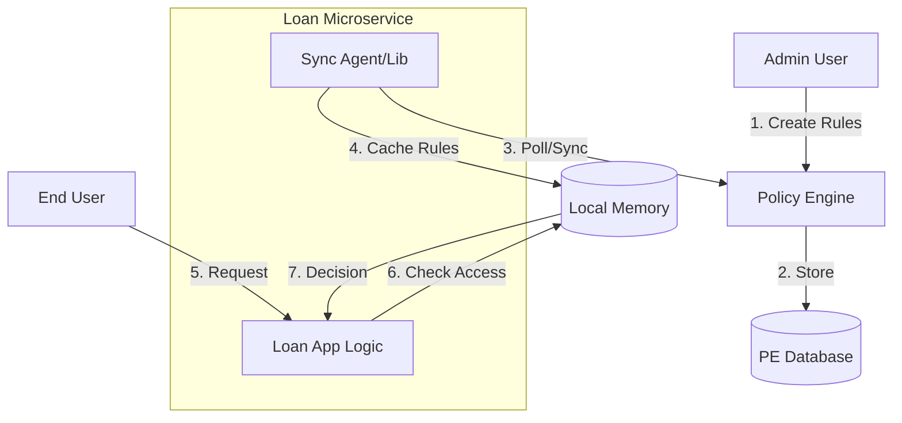

# Design: Decentralized Entitlement & Policy Management

## Core Philosophy: Decentralized Enforcement
We are moving from a **Centralized Authorization** model (Policy Engine decides) to a **Decentralized Enforcement** model.
*   **Policy Engine**: Acts as the **Control Plane**. It is the "Source of Truth" for who can do what (Entitlements) and under what conditions (Policies).
*   **Microservices (Resource Providers)**: Act as the **Data Plane**. They download/sync the rules and enforce them locally. This ensures low latency and high availability.

---

## 1. Entitlement Management Structure

### "Generic Structure, Specific Content"
Entitlements should remain **generic** in structure but contain **domain-specific** data. We should not create separate "tables" for each resource type.

**Proposed Data Model**:
```json
{
  "id": "ent-123",
  "subject": { "type": "USER", "id": "alice" },
  "resource": { "type": "loan-service:loan", "id": "L-101" }, // Namespaced Type
  "actions": ["read", "approve"],
  "policyId": "pol-456" // OPTIONAL: Direct link to a specific policy
}
```

### Management Hierarchy
We should manage entitlements at the **Resource Type** level.
1.  **Global Entitlements**: "Admins can `*` on `*`".
2.  **Type-Level Entitlements**: "LoanManagers can `approve` on `loan-service:loan`".
3.  **Instance-Level Entitlements**: "User Bob can `read` on `loan-service:loan:L-101`".

---

## 2. Associating Policies with Entitlements

You asked: *"Should we associate a policy with each entitlement created?"*

**Recommendation: The "Binding" Approach**
Directly linking a Policy ID to every single Entitlement row is tedious and hard to maintain. Instead, we should use a **Policy Binding** model (similar to Kubernetes RBAC or AWS IAM).

### The Model
1.  **Entitlement (The "Who" and "What")**: Defines the *relationship* between a Subject and a Resource.
    *   *Example*: "Alice is an Owner of Loan-101".
2.  **Policy (The "Conditions")**: Defines the *logic* for access.
    *   *Example*: "Owners can Read if time is 9-5".
3.  **Binding (The Association)**:
    *   **Implicit Binding (Recommended)**: Policies are assigned to **Resource Types** and **Actions**.
        *   *Config*: "For `loan-service:loan` + `read`, execute Policy `StandardAccessPolicy`".

### 2.1 Policy Entity

| Field | Type | Description |
| :--- | :--- | :--- |
| `id` | Long | Unique identifier |
| `name` | String | Unique name/ID of the policy |
| `description` | String | (New) Short description of the policy |
| `filename` | String | (New) Unique filename for the policy in the bundle (e.g., `authz.rego`) |
| `content` | Text | Rego policy content |
| `version` | String | Semantic version |
| `status` | Enum | DRAFT, ACTIVE, ARCHIVED |
| `sourceType` | Enum | MANUAL, GIT |

### 2.2 PolicyBinding Entity

| Field | Type | Description |
| :--- | :--- | :--- |
| `id` | Long | Unique identifier |
| `resourceType` | String | The resource type these policies apply to |
| `context` | String | The context identifier (e.g., `authz`) |
| `policyIds` | List<String> | (New) List of Policy Names bound to this context |
| `evaluationMode` | Enum | DIRECT, ATTRIBUTE, CONDITION |
        *   *Runtime*: When Alice tries to Read Loan-101, the Microservice sees she has the "Owner" entitlement. It then looks up the policy for "Loan Read" and executes it.

### Management UI: Policy Bindings
We need a dedicated screen to manage these bindings.
*   **View**: Table showing `Resource Type` | `Action` | `Bound Policy`.
*   **Edit**: Admin selects a Resource Type (e.g., `loan-service:loan`), selects an Action (e.g., `approve`), and chooses a Policy from a dropdown.
*   **Backend**: New Entity `PolicyBinding` (`resourceType`, `action`, `policyId`).

### Configuration: Enterprise Actions
Actions (Read, Write, Approve, etc.) should not be hardcoded. They should be configurable to match the enterprise domain.
*   **Action Registry**: A simple configuration (DB table or Config Map) listing available actions.
    *   *Examples*: `read`, `write`, `delete`, `approve`, `reject`, `delegate`.
*   **Usage**:
    *   **Entitlement Creation**: The "Actions" dropdown is populated from this registry.
    *   **Policy Binding**: The "Action" dropdown is populated from this registry.

**Why this is better?**
*   **Scale**: You don't need to update 1 million entitlement records to change the access logic. You just update the one Policy bound to "Loan Read".
*   **Performance**: Microservices cache the policy for the *Type*, not for every single ID.
*   **Flexibility**: New actions can be added without code changes.

---

## 3. Decentralized Architecture (The "Sync" Model)

### Policy Engine Responsibilities (Control Plane)
1.  **Authoring**: UI to create Policies (Rego/Script) and Entitlements.
2.  **Distribution Endpoint**: `GET /api/v1/bundles/download?resourceTypes=loan-service:loan`.
    *   Returns a `.tar.gz` bundle (Policies + Data) filtered by resource type.

### Microservice Responsibilities (Data Plane)
1.  **Sidecar / Library**: Use a lightweight library (or OPA sidecar) to fetch the bundle from Policy Engine on startup (and periodically).
2.  **Local Evaluation**:
    *   Request comes in: `GET /loans/101`.
    *   Microservice checks local memory:
        1.  **Lookup Entitlement**: Does User have an entitlement for `101`? -> Yes, "Owner".
        2.  **Lookup Policy**: What is the policy for "Loan Read"? -> `StandardAccessPolicy`.
        3.  **Execute**: Run `StandardAccessPolicy` with input `{user, resource, entitlement}`.
    *   **Decision**: Allow/Deny.
    
    ### 3.1 Two Modes of Entitlement Management
    
    We support two modes for managing entitlements:
    1.  **Centralized Authoring (Pull)**: Admins create entitlements in the Policy Engine UI. Services pull these down via the bundle.
    2.  **Service-Owned (Push)**: The source of truth for entitlements (e.g., "ownership") lives in the Domain Service. The service **pushes** these to the Policy Engine via the Sync API (`POST /api/v1/entitlements/sync`). The Policy Engine then redistributes them in bundles to OPA/Enforcement points.

### Data Flow Diagram


---

## 4. Proposed UI/UX Changes

1.  **Policy Management**:
    *   New Page: **Policies**. Professional Editor (**Monaco**) for logic.
    *   **GitOps Support**: Policies can be sourced from Git repositories with an optional **Sync** workflow.
    *   **File Upload**: Support for uploading `.rego` files directly.
2.  **Resource Type Configuration** (New):
    *   Select "Loan Service".
    *   Define **Default Policies**: "For `read` action, use `Policy A`".
3.  **Entitlement Management** (Modified):
    *   Select Subject & Resource.
    *   (Optional) "Policy Override": Select a specific policy if needed.
