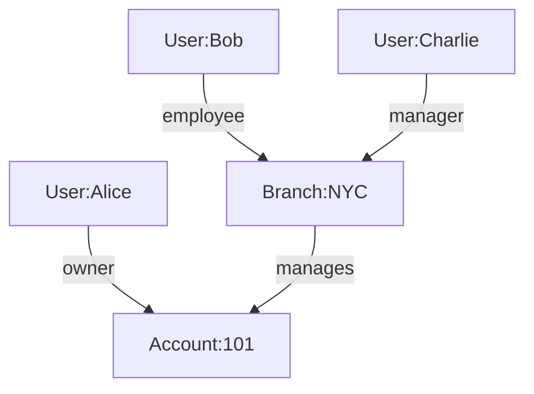

# ReBAC System Design

## 1. The Ecosystem as a Graph
In a complex enterprise environment (such as Banking), your data is not just a collection of isolated tables; it is a rich web of interconnected entities.

Imagine a typical setup:
-   **Users**: Employees (Alice, Bob) and Customers.
-   **Structure**: Branches (Manhattan, London) and Corporate Hierarchies (Acme Corp -> Acme Subsidiary).
-   **Resources**: Accounts, Loans, Portfolios.

### 1.1 Modeling Relationships
We can model this entire ecosystem as a **Directed Graph**.
-   **Nodes**: The entities (User:Alice, Branch:NYC, Account:101).
-   **Edges**: The relationships connecting them.

**Visualizing the Graph:**


### 1.2 Access as Reachability
In this graph model, **Access Control** simply becomes a question of **Reachability**.
*   **Question**: "Can Bob view Account:101?"
*   **Translation**: "Is there a valid path from `User:Bob` to `Account:101`?"

We can see a path:
`User:Bob` -> (employee) -> `Branch:NYC` -> (manages) -> `Account:101`.

If we define a rule that says *"Employees of a Branch can view accounts managed by that Branch"*, then Bob has access. This approach allows us to answer complex questions by simply walking the graph.

---

## 2. From Actions to Relations
Business users think in terms of **Actions** (e.g., "Transfer Funds", "Audit Branch").
The System thinks in terms of **Relations** (e.g., "Owner", "Manager").

We bridge this gap with an **Authorization Model**.

### 2.1 The Mapping Logic
We define rules for each Resource Type.
*   **Direct Access**: Explicit relationship. "If you are an `owner`, you can `transfer`."
*   **Computed Access**: "Daisy-chain" relationships. "If you are an `employee` of the `manager`, you are `staff`."

### 2.2 Rules of Reachability
1.  **Direct**: A single step path. `Subject -> Resource`.
2.  **Computed (via)**: A multi-step path. `Subject -> (Relation A) -> Intermediate -> (Relation B) -> Resource`.

---

## 3. The Authorization Model (Configuration)
This configuration defines the "Physics" of our graph. It tells the system which paths are valid.
Stored in the database, this JSON schema is the single source of truth for permission logic.

### JSON Structure
```json
{
  "authorization_model": {
    "account": {
      "actions": {
        "view_balance": ["owner", "branch_staff"],
        "transfer": ["owner"]
      },
      "relations": {
        "owner": { "type": "direct" },
        "managed_by": { "type": "direct" },
        "branch_staff": {
          "type": "computed",
          "via": "managed_by",        // The edge leaving the Account (pointing to Branch)
          "required_relation": "employee" // The required relation on that Branch
        }
      }
    },
    "branch": {
      "actions": { "audit": ["manager"] },
      "relations": {
        "manager": { "type": "direct" },
        "employee": { "type": "direct" }
      }
    }
  }
}
```
**Explanation**:
-   To `view_balance` on an `account`, you must be an `owner` OR `branch_staff`.
-   `branch_staff` is not stored in the DB. It is computed: Find who `manages` this account (The Branch), and check if the user is an `employee` of that Branch.

---

## 4. The Relationship Tuples (The Data)
While the Model defines the *Rules*, the Tuples define the *Facts*.
A **Relationship Tuple** is a single edge in our graph: `(Subject, Relation, Object)`.

### 4.1 JSON Representation
To allow for ultra-fast checks (O(1) lookup), we organize tuples by the **Object** they target.

```json
{
  "tuples": {
    "account:101": [
      { "subject": "user:alice", "rel": "owner" },
      { "subject": "branch:nyc", "rel": "managed_by" }
    ],
    "branch:nyc": [
      { "subject": "user:bob", "rel": "employee" },
      { "subject": "user:charlie", "rel": "manager" }
    ]
  }
}
```

### 4.2 Computation & Ingestion Strategy
How do we get this JSON? We don't want to manage it manually.
We use a **Tuple Ingestion Process**:

1.  **Source**: Your existing databases (`Accounts` table, `Branch_Employees` table).
2.  **Transformation (Mappers)**:
    -   We define a query: `SELECT id, manager_id FROM accounts`.
    -   We map the result: `id` -> Object, `manager_id` -> Subject, Relation -> `managed_by`.
3.  **Ingest**: A service runs this transformation periodically (or via Change Data Capture) and pushes the resulting JSON into the ReBAC engine.

---

## 5. Execution: The Generic Policy Engine
Now that we have the **Rules** (Model) and the **Facts** (Tuples), our Policy Engine (OPA/Rego) can make decisions generically. It doesn't need to know what an "Account" is; it just looks at the graph.

### 5.1 The Logic (Rego)
The core logic is a recursive function that attempts to find a path.

```rego
package rebac.authz

# Main Check
allow {
    # 1. Look up what relations allow this Action
    required_rels := data.authorization_model[input.resource_type].actions[input.action]
    
    # 2. Check if User has ANY of these relations to the Resource
    some r in required_rels
    check_relation(input.user_id, r, input.resource_id)
}

# Recursion: The "Pathfinder"
check_relation(user, relation, object) {
    # Is it a direct connection?
    tuple := data.tuples[object][_] 
    tuple.rel == relation
    tuple.subject == user
}

check_relation(user, relation, object) {
    # Is it a computed connection?
    rule := data.authorization_model[object.type].relations[relation]
    rule.type == "computed"
    
    # Walk the graph:
    # 1. Find the intermediate node (The Bridge)
    bridge_tuple := data.tuples[object][_]
    bridge_tuple.rel == rule.via
    bridge := bridge_tuple.subject
    
    # 2. RECURSE: Check if user has the required relation on the Bridge
    check_relation(user, rule.required_relation, bridge)
}
```

### 5.2 Example Flow: "Can Bob View Balance?"

**Scenario**: `User:Bob` wants to `view_balance` on `Account:101`.

1.  **Input**: `{ user: "bob", action: "view_balance", resource: "account:101" }`
2.  **Model Lookup**:
    -   Action `view_balance` requires: `["owner", "branch_staff"]`.
3.  **Check 1**: Is Bob `owner` of `account:101`?
    -   Look at `tuples["account:101"]`.
    -   Found: `alice` (owner).
    -   Result: **No**.
4.  **Check 2**: Is Bob `branch_staff` of `account:101`?
    -   This is `computed`.
    -   Rule: `via: "managed_by"`, `required: "employee"`.
    -   **Step A (Find Bridge)**: Look at `tuples["account:101"]` for `managed_by`.
        -   Found: `branch:nyc`.
    -   **Step B (Recurse)**: Check if Bob is `employee` of `branch:nyc`.
        -   Look at `tuples["branch:nyc"]`.
        -   Found: `bob` (employee).
        -   Result: **Yes**.
5.  **Final Result**: **ALLOW**.

---

## 6. Summary for Stakeholders
-   **Business Users**: You define the rules ("Managers of branches can audit"). The system automatically enforces them without code changes.
-   **Developers**: You focus on mapping your data to Tuples. A single, standard Policy Engine handles all the complex graph traversal logic centrally.
-   **Architects**: The system is decoupled. You can evolve your data model (Tuples) and your security rules (Model) independently.